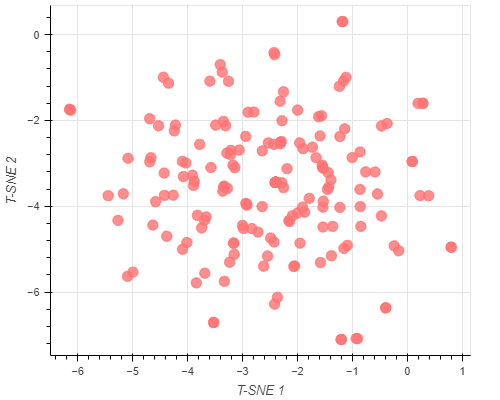

# project-data-analysis

# Présentation 

Ceci est un prototype en analyse de donnée sur les listes d'ingrédient de 1472 cosmétiques sur Sephora .  
Il existe six catégories de produits dans nos données ( hydratants, nettoyants, masques pour le visage, crèmes pour les yeux et protection solaire ) et il existe cinq types de peau différents ( mixtes, sèches, normales, grasses et sensibles ).
  

--------------------------------------------------------------------------------------------------------------------------------------------------

## Bibliothéque : 
On a utilisé les bibliothèques : 
 - *Pandas* :  est un outil d'analyse et de manipulation de données open source rapide, puissant, flexible et facile à utiliser.  
        

 - *Numpy* : fournit une interface efficace pour stocker et exploiter des tampons de données denses.
        

 - *Bokeh* : permet de créer des visualisations interactives pour les navigateurs Web modernes. Il vous aide à créer de superbes graphiques, allant de simples tracés à des tableaux de bord complexes avec des ensembles de données en continu.  
         

 -  *Scikit-learn*  :Il comporte divers algorithmes de classification , de régression et de clustering , notamment des machines à vecteurs de support , des forêts aléatoires , l'amplification de gradient , k -means et DBSCAN , et est conçu pour interagir avec les bibliothèques numériques et scientifiques Python NumPy et Scipy .
        

------------------

__TSNE__ : 

* L'intégration de voisins stochastiques à distribution T (t-SNE) est une technique de réduction de dimensionnalité non linéaire qui convient bien à l'intégration de données de grande dimension pour la visualisation dans un espace de faible dimension à deux ou trois dimensions.

  
  
  