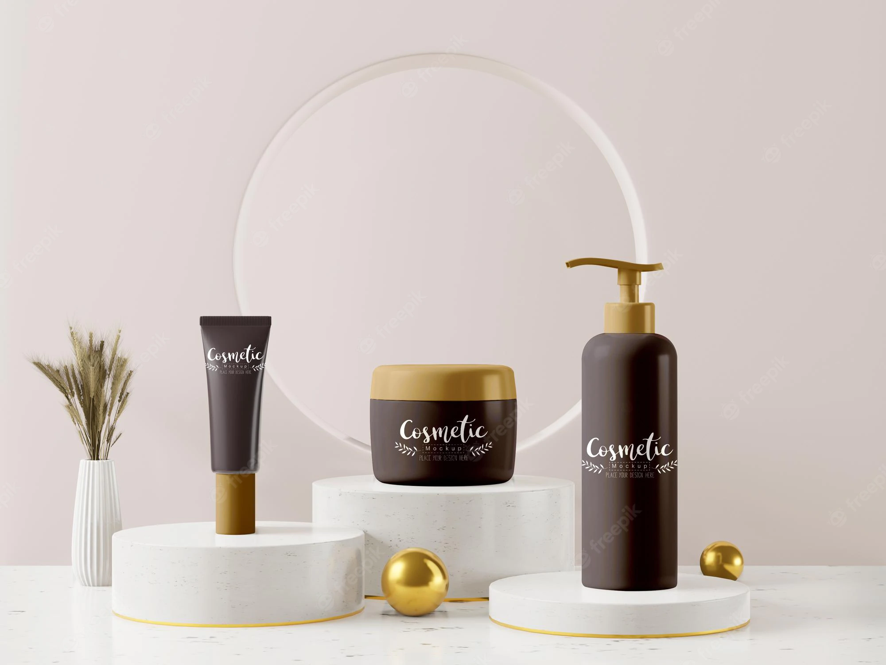

# 💻 project-data-analysis

# 🔴 Présentation : 

Ceci est un prototype en analyse de donnée sur les listes d'ingrédient de 1472 cosmétiques sur Sephora .  
Il existe six catégories de produits dans nos données ( hydratants, nettoyants, masques pour le visage, crèmes pour les yeux et protection solaire ) et il existe cinq types de peau différents ( mixtes, sèches, normales, grasses et sensibles ).
  

--------------------------------------------------------------------------------------------------------------------------------------------------

## Bibliothéque : 
On a utilisé les bibliothèques : 
 - *Pandas* :  est un outil d'analyse et de manipulation de données open source rapide, puissant, flexible et facile à utiliser.  
        

 - *Numpy* : fournit une interface efficace pour stocker et exploiter des tampons de données denses.
        

 - *Bokeh* : permet de créer des visualisations interactives pour les navigateurs Web modernes. Il vous aide à créer de superbes graphiques, allant de simples tracés à des tableaux de bord complexes avec des ensembles de données en continu.  
         

 -  *Scikit-learn*  :Il comporte divers algorithmes de classification , de régression et de clustering , notamment des machines à vecteurs de support , des forêts aléatoires , l'amplification de gradient , k -means et DBSCAN , et est conçu pour interagir avec les bibliothèques numériques et scientifiques Python NumPy et Scipy .
        

------------------

__TSNE__ : 

* L'intégration de voisins stochastiques à distribution T (t-SNE) est une technique de réduction de dimensionnalité non linéaire qui convient bien à l'intégration de données de grande dimension pour la visualisation dans un espace de faible dimension à deux ou trois dimensions.

 
                

---------------------------------------------------------

- Resultat d'une comparaison entre deux produit 

Label	Brand	Name	Price	Rank	Ingredients	Combination	Dry	Normal	Oily	Sensitive	X	Y
45	Moisturizer	AMOREPACIFIC	Color Control Cushion Compact Broad Spectrum S...	60	4.0	Phyllostachis Bambusoides Juice, Cyclopentasil...	1	1	1	1	1	-2.41354	-0.466799

['Phyllostachis Bambusoides Juice, Cyclopentasiloxane, Cyclohexasiloxane, Peg-10 Dimethicone, Phenyl Trimethicone, Butylene Glycol, Butylene Glycol Dicaprylate/Dicaprate, Alcohol, Arbutin, Lauryl Peg-9 Polydimethylsiloxyethyl Dimethicone, Acrylates/Ethylhexyl Acrylate/Dimethicone Methacrylate Copolymer, Polyhydroxystearic Acid, Sodium Chloride, Polymethyl Methacrylate, Aluminium Hydroxide, Stearic Acid, Disteardimonium Hectorite, Triethoxycaprylylsilane, Ethylhexyl Palmitate, Lecithin, Isostearic Acid, Isopropyl Palmitate, Phenoxyethanol, Polyglyceryl-3 Polyricinoleate, Acrylates/Stearyl Acrylate/Dimethicone Methacrylate Copolymer, Dimethicone, Disodium Edta, Trimethylsiloxysilicate, Ethylhexyglycerin, Dimethicone/Vinyl Dimethicone Crosspolymer, Water, Silica, Camellia Japonica Seed Oil, Camillia Sinensis Leaf Extract, Caprylyl Glycol, 1,2-Hexanediol, Fragrance, Titanium Dioxide, Iron Oxides (Ci 77492, Ci 77491, Ci77499).']

Label	Brand	Name	Price	Rank	Ingredients	Combination	Dry	Normal	Oily	Sensitive	X	Y
55	Moisturizer	LANEIGE	BB Cushion Hydra Radiance SPF 50	38	4.3	Water, Cyclopentasiloxane, Zinc Oxide (CI 7794...	1	1	1	1	1	-2.424875	-0.420208

['Water, Cyclopentasiloxane, Zinc Oxide (CI 77947), Ethylhexyl Methoxycinnamate, PEG-10 Dimethicone, Cyclohexasiloxane, Phenyl Trimethicone, Iron Oxides (CI 77492), Butylene Glycol Dicaprylate/Dicaprate, Niacinamide, Lauryl PEG-9 Polydimethylsiloxyethyl Dimethicone, Acrylates/Ethylhexyl Acrylate/Dimethicone Methacrylate Copolymer, Titanium Dioxide (CI 77891 , Iron Oxides (CI 77491), Butylene Glycol, Sodium Chloride, Iron Oxides (CI 77499), Aluminum Hydroxide, HDI/Trimethylol Hexyllactone Crosspolymer, Stearic Acid, Methyl Methacrylate Crosspolymer, Triethoxycaprylylsilane, Phenoxyethanol, Fragrance, Disteardimonium Hectorite, Caprylyl Glycol, Yeast Extract, Acrylates/Stearyl Acrylate/Dimethicone Methacrylate Copolymer, Dimethicone, Trimethylsiloxysilicate, Polysorbate 80, Disodium EDTA, Hydrogenated Lecithin, Dimethicone/Vinyl Dimethicone Crosspolymer, Mica (CI 77019), Silica, 1,2-Hexanediol, Polypropylsilsesquioxane, Chenopodium Quinoa Seed Extract, Magnesium Sulfate, Calcium Chloride, Camellia Sinensis Leaf Extract, Manganese Sulfate, Zinc Sulfate, Ascorbyl Glucoside.']
  

  
  
  